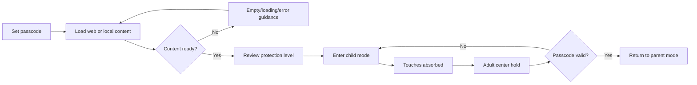

# Core experience wireframes

These low-fidelity frames describe the implemented interaction model and proposed failure-state copy. They do not claim pixel parity.

## 1. First launch: establish recoverability

```text
┌──────────────────────────────────┐
│ BabyLock                         │
│                                  │
│ Before you hand over your phone  │
│ create a 4–6 digit passcode.     │
│ It is required to leave Child    │
│ Mode.                            │
│                                  │
│             ○ ○ ○ ○              │
│          [ number pad ]          │
│                                  │
│ Protection note                  │
│ BabyLock blocks touches in this  │
│ app. Guided Access prevents exit.│
└──────────────────────────────────┘
```

**Why:** passcode setup is already the entry gate in [`BabyLock/App/AppState.swift`](../../BabyLock/App/AppState.swift). Protection language belongs here, before confidence is formed.

## 2. Parent mode: prepare, verify, commit

```text
┌────────────────────────────────────────┐
│  Content viewport                      │
│                                        │
│       selected web page / media        │
│                                        │
├────────────────────────────────────────┤
│ [Back] [Forward] [ URL / search     ]  │
│ [Photos] [Settings]          [LOCK]    │
└────────────────────────────────────────┘
```

Information hierarchy: content readiness first; primary `LOCK` action second; navigation and settings subordinate. Lock is disabled until content exists, matching [`BabyLock/Parent/ParentView.swift`](../../BabyLock/Parent/ParentView.swift).

## 3. Protection checkpoint (hypothesis)

```text
┌──────────────────────────────────┐
│ Ready to hand over?              │
│                                  │
│ ✓ In-app touches will be blocked │
│ ! Guided Access is NOT active    │
│   The home gesture may still     │
│   allow leaving BabyLock.        │
│                                  │
│ [How to enable]  [Lock anyway]   │
└──────────────────────────────────┘
```

**Why:** the current tutorial appears after unlock. A pre-handoff checkpoint is a hypothesis to test because risk comprehension matters before use.

## 4. Child mode: happy path

```text
┌──────────────────────────────────┐
│                                  │
│                                  │
│          CONTENT ONLY            │
│        (touches absorbed)         │
│                                  │
│              ◔                   │  ← subtle ring only while
│                                  │    adult holds center
└──────────────────────────────────┘
```

The ring must not become a discoverable button. It should communicate progress to the adult and reset on movement/lift, consistent with [`BabyLock/ChildMode/ChildModeController.swift`](../../BabyLock/ChildMode/ChildModeController.swift).

## 5. Adult recovery

```text
┌──────────────────────────────────┐
│ Enter Passcode to Unlock         │
│                                  │
│             ● ● ○ ○              │
│          [ 1 ] [ 2 ] [ 3 ]       │
│          [ 4 ] [ 5 ] [ 6 ]       │
│          [ 7 ] [ 8 ] [ 9 ]       │
│                [ 0 ]             │
│                                  │
│ Incorrect passcode. Try again.   │
└──────────────────────────────────┘
```

Wrong passcode returns to a recoverable state without revealing the code. Avoid vibration or loud error feedback that could attract child interaction.

## 6. Empty, loading, and error states

```text
EMPTY                         LOADING
┌────────────────────┐        ┌────────────────────┐
│ Choose content     │        │ Loading content…   │
│ Browse or select a │        │ [progress]         │
│ photo/video.       │        │ Lock unavailable   │
│ [Browse] [Photos]  │        └────────────────────┘
│ Lock unavailable   │
└────────────────────┘

ERROR
┌──────────────────────────────────┐
│ Content could not be loaded      │
│ You are still in Parent Mode.    │
│ Check the address or choose      │
│ local media.                     │
│ [Try again] [Choose media]       │
└──────────────────────────────────┘
```

**Why:** never represent a blank or failed source as safe-to-hand-over.

## Flow



## Accessibility and responsive notes

- Do not rely on color alone for Guided Access status; pair icon, label, and plain language.
- Keep parent controls at least 44×44 points with VoiceOver labels and logical focus order.
- Offer a tested alternate unlock accommodation before claiming motor accessibility; a fixed five-second center hold may exclude some adults.
- Support portrait and landscape because [`project.yml`](../../project.yml) declares both. Keep the unlock target centered in the current bounds.
- Dynamic Type should reflow parent screens; child mode should not overlay textual controls.
- Passcode errors should be announced to assistive technology without exposing entered digits.
